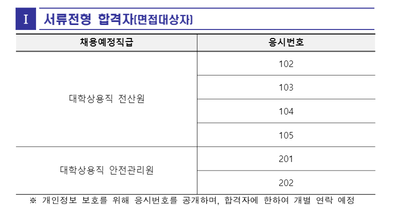
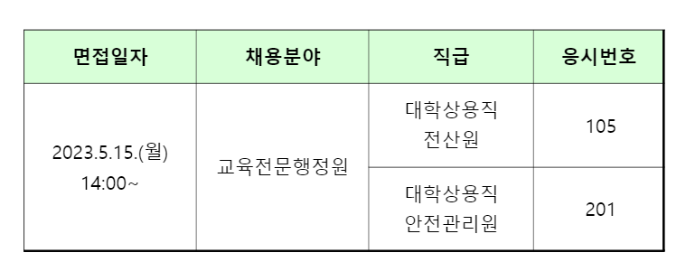
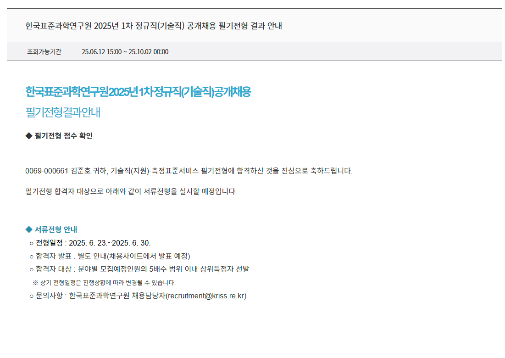
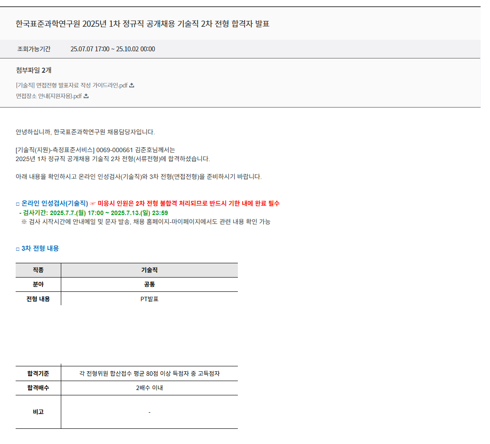
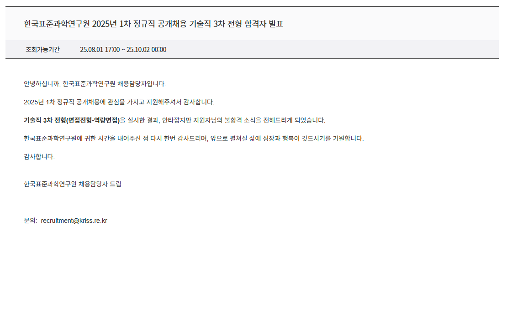
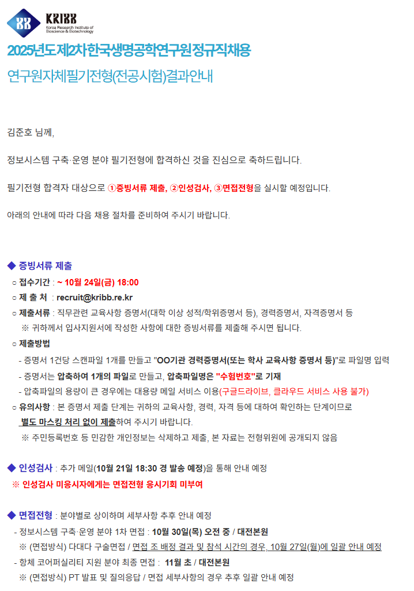
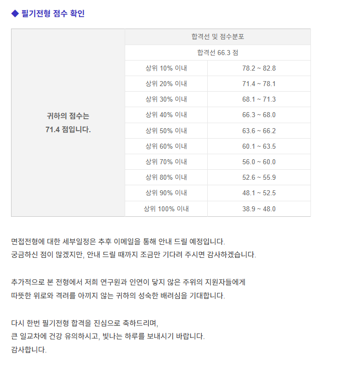

 
# 취업도전 리스트
- 세종텔레콤
- 트위니
- 루센트블록
- 바이브컴퍼니
- 충북대병원
- 한국환경연구원
- 한국특허정보원
- 한국의료분쟁조정중재원
- 송파구시설관리공단
- 충남대학교
- 세종시설관리공단
- 대전일자리경제진흥원
- 한국표준과학연구원
- 한국세라믹기술원
- 한국생명공학연구원

 
 
## 세종텔레콤

세종텔레콤 주식회사는 대한민국 기간통신사업자로, 국가 정보통신기술의 진흥에 기여하고 국민에게 새로운 경험과 가치를 제공하여 국민 편익과 복지 향상에 이바지하고 있다. 2000년 코스닥에 상장되었으며 주 사업분야는 통신 부문과 전기공사 부문으로 구분된다.

| **종류** | **합격** |
|:--------:|:--------:|
| **서류** | **합격** |
| **실무면접** | **합격** |
| **임원면접** | **합격** |
| **최종** | **입사** |
 

 
 
## 트위니

자율주행로봇 개발 전문기업. 물류센터의 자율주행 오더피킹 카트, 자율주행 운반대차, 자율주행 호텔 서비스 로봇. 모바일 메신저 개발.

| **종류** | **합격** |
|:--------:|:--------:|
| **서류** | **합격** |
| **실무면접** | **취소** |

 

## 루센트블록

금융위원회 금융혁신서비스 지정 부동산 증권 거래 플랫폼

| **종류** | **합격** |
|:--------:|:--------:|
| **서류** | **합격** |
| **실무면접** | **합격** |
| **임원면접** | **취소** |

 

## 바이브컴퍼니

바이브컴퍼니는 2000년부터 빅데이터 자료를 수집하고 분석해 인사이트를 도출해내는 대한민국 최초이자 최대 빅데이터 전문 기업이다. 다음커뮤니케이션의 사내 인큐베이팅으로 출발, 인공지능 지능형 서비스를 연구 개발하기 위해 2000년 '다음소프트'로 독립 법인을 설립했다

| **종류** | **합격** |
|:--------:|:--------:|
| **서류** | **합격** |
| **실무면접** | **합격** |
| **임원면접** | **합격** |
| **최종** | **입사** |

 

## 충북대병원

충북대학교병원(忠北大學校病院, 영어: Chungbuk National University Hospital)은 고등교육법에 의한 의학, 치의학, 간호학, 약학등에 관한 교육, 연구와 진료를 통하여 의학발전을 도모하고 국민보건향상에 이바지함을 목적으로 국립대학교병원설치법에 의거 1984년 10월 충북대학교 자연과대학 의예과 설치인가받아 1995년 8월 법인 충북대학교병원으로 전환된 교육부 산하 기타공공기관이자 대학 병원이다. 충청북도 청주시 서원구 1순환로 776(개신동)에 위치하고 있다.

| **종류** | **합격** |
|:--------:|:--------:|
| **서류** | **합격** |
| **필기** | **합격** |
| **면접** | **불합** |

 

## 한국환경연구원

한국환경연구원은 환경정책을 연구하고 환경영향평가 검토업무를 수행하는 공공기관이다. 1992년에 "한국환경기술개발원"이라는 이름으로 설립되었다가 1997년에 해산되었고, 동시에 "한국환경정책·평가연구원"으로 재설립되었다. 2021년 8월 17일 "한국환경연구원"으로 명칭이 변경되었다.

| **종류** | **합격** |
|:--------:|:--------:|
| **서류** | **합격** |
| **필기** | **합격** |
| **면접** | **합격** |
| **최종** | **입사포기** |

 

## 한국특허정보원

한국특허정보원은 1995년 7월 설립된 특허청 산하 종합 특허기술정보 서비스 전문기관으로 대전광역시 서구 둔산서로 137, 5층 에 위치한 본원과 서울특별시 강남구 테헤란로 131, 7층에 위치한 서울지원을 운영 중에 있다.

| **종류** | **합격** |
|:--------:|:--------:|
| **서류** | **합격** |
| **필기** | **불합** |

 

## 한국의료분쟁조정중재원

한국의료분쟁조정중재원은 의료사고의 신속·공정한 피해구제 및 보건의료인의 안정적인 진료환경 조성을 위해 설립된 보건복지부 산하 공공기관이다. 서울특별시 중구 후암로 110, 18층 에 위치하고 있다.

| **종류** | **합격** |
|:--------:|:--------:|
| **서류** | **합격** |
| **면접** | **합격** |
| **최종** | **입사포기** |

 

## 송파구시설관리공단

송파구의 시설물을 효율적으로 운영하여 송파구의 발전과 지역주민의 복리증진에 기여함을 목적으로 설립된 송파구청 산하 지방공기업. 본사는 서울특별시 송파구 충민로 66, 라이프동 테크노관 10층 T-10017 (문정동, 가든파이브)에 위치해 있다.

| **종류** | **합격** |
|:--------:|:--------:|
| **서류** | **합격** |
| **면접** | **합격** |
| **최종** | **입사포기** |

 
 
 
## 충남대학교

대전광역시 유성구 대학로 99 (궁동), 대전광역시 중구 문화로 266 (문화동), 세종특별자치시 집현동 58에 소재한 국립 종합대학이다. 1952년 개교한 충남대학을 시초로 하고 있으며, 2022년에는 개교 70주년을 맞이하였다.
거점국립대학교답게 법학전문대학원, 사범대학, 수의과대학, 약학대학, 의과대학 등이 모두 있으며, 이들을 포함한 14개 단과대학[4], 2개 직할학부[5], 14개 대학원[6]으로 구성되어 있다. 그 외 학교 부속기관으로 도서관, 박물관, 정보통신원, 공동실험실습관, 연구림, 사회교육원, 외국어교육원 등과 61개 연구기관[7]이 있다.
학교의 공식 약칭은 충대(忠大)[8]이며, 학교의 공식 영문 약칭은 CNU이다.

| **종류** | **합격** |
|:--------:|:--------:|
| **서류** | **합격** |
| **면접** | **합격** |
| **최종** | **입사** |

 
 
 
## 한국세라믹기술원

산업기술혁신 촉진법 제39조의2(한국세라믹기술원의 설립 등)
① 세라믹 연구개발, 시험ㆍ분석ㆍ평가, 기술지원 및 세라믹산업 정책지원 등을 위하여 한국세라믹기술원(이하 “세라믹기술원”이라 한다)을 설립한다.

세라믹 연구개발, 시험·분석·평가, 기술지원 및 정책지원 등의 기능을 수행하여 세라믹 산업의 경쟁력 제고에 기여하기 위하여 설립된 산업통상부 산하 기타공공기관이다.

| **종류** | **합격** |
|:--------:|:--------:|
| **서류** | **합격** |
| **면접** | **합격** |

 
 
 
## 한국표준과학연구원

'과학기술분야 정부출연연구기관 등의 설립·운영 및 육성에 관한 법률'에 따라 설립된 대한민국의 도량형 분야 연구기관이다.
국가측정표준 확립 및 유지·향상, 측정과학기술 연구개발, 측정표준 보급 및 서비스를 주요 임무로 한다. 영문약칭은 KRISS이며, 일반적으로 표준연이라는 약칭을 사용한다.
대전 시내에서 대덕대로를 따라 북상하다가(또는 북대전 IC에서 남하하다가) 연구단지네거리에서 서쪽으로 방향을 틀어 가정로를 따라간다면 제일 먼저 만나게 되는 연구원이기도 하다. [3]
간판에 ‘표준’이라는 표현을 쓰는 것에 걸맞게 우리나라 모든 분야의 측정에 관한 표준을 갖춘 곳이며, 단위 재정의 이전까지 사용되던 각종 원기들과 표준시계를 보유한 곳이다.
2024년 공공기관에서 지정 해제되었다.

| **종류** | **합격** |
|:--------:|:--------:|
| **필기** | **합격** |
| **서류** | **합격** |
| **면접** | **불합격** |

 

 
## 한국생명공학연구원

생명과학기술 분야의 연구개발 및 공공인프라 구축·운영을 통해 국가 생명과학기술, 산업 발전 및 국가·사회현안 해결에 기여함을 목적으로 설립된 과학기술분야 정부출연연구기관이다. 본원은 대전에 있으며, 충청북도 청주시 오창읍과 전북특별자치도 정읍시에 분원을 두고 있다. 영문약칭인 KRIBB(크립)이 있지만 보통은 생명연이라는 약칭이 많이 사용된다.
2024년 공공기관에서 지정 해제되었다.
UST를 통해 이곳에서 대학원 학위과정을 진행할 수 있으며, 동계/하계방학 시즌에는 UST 인턴십이나 협약 학교의 현장실습을 통해 학부생들이 이곳의 연구환경을 경험할 수 있다.[1] 타지에서 이곳에 와서 연구하는 연구자들을 위해 자체 기숙사도 운영하고 있다.
사내은행으로 국민은행이 입점해 있다. 다만 보안상 외부인 이용은 어렵다.
KAIST와 울타리 하나를 두고 이웃하고 있으며, 연구 측면에서도 많은 협력이 이루어지는 만큼 이곳에서 카이스트 교내로 연결되는 연결로가 뚫려있다.

| **종류** | **합격** |
|:--------:|:--------:|
| **서류** | **합격** |
| **필기** | **합격** |

 
